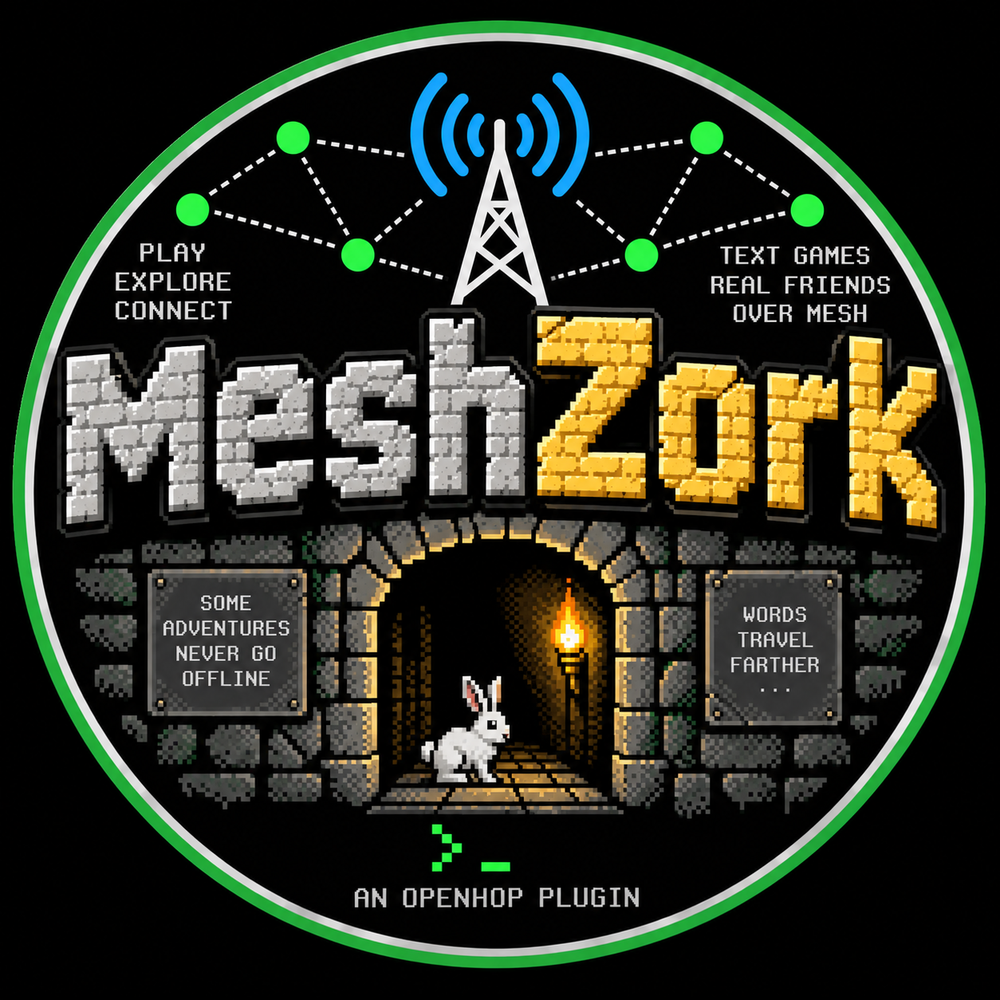

# MeshZork for openHop

Created for and credited to **MacKayz117**.



MeshZork lets players run the complete historical Zork I game by direct-messaging
a dedicated MeshCore Companion identity on an openHop Repeater. Each sender gets
an independent SQLite-backed game session. Long descriptions are divided into
LoRa-friendly numbered packets. Short multi-part replies continue automatically;
players use `NEXT` only when unusually long output remains.

The bundled version 3 Z-machine program comes from Microsoft's
[Historical Source repository for Zork I](https://github.com/historicalsource/zork1)
and is distributed there under the MIT License. Zork is a trademark of its
respective owner; this community plugin is not an official Microsoft or Infocom
product. See [THIRD_PARTY_NOTICES.md](THIRD_PARTY_NOTICES.md).

## What the plugin does

- receives plain-text direct messages through an openHop Companion TCP server;
- identifies a player by the six-byte MeshCore sender prefix;
- runs the complete Zork I story through a bundled pure-Python interpreter dependency;
- saves each player's command history in SQLite and reconstructs the exact game
  state with a fixed random seed after plugin or repeater restarts;
- persists sessions across plugin and repeater restarts;
- ignores duplicate radio deliveries using sender, timestamp, and command hash;
- divides long output into numbered UTF-8 responses of at most 145 bytes and
  automatically sends up to four pages with a radio-friendly pause;
- suppresses the repetitive score/move status bar to save airtime (`SCORE` still works);
- permits three active players, releasing a slot after 15 minutes of inactivity;
- removes saved games after 30 days without activity so storage stays bounded;
- provides a dashboard settings page for player capacity, inactivity timeout,
  and save retention;
- reconnects automatically if the Companion server is temporarily unavailable;
- runs as a child of `openhop-plugin-manager`, outside the repeater process.

All normal Zork I commands are supported. `NEXT` (or `MORE`) retrieves any page
remaining after automatic delivery, `RESET` starts a fresh game, and `HELP`
explains the radio wrapper. Saving and restoring are automatic, so the game's
interactive `SAVE` and `RESTORE` prompts are replaced with a short explanation.

## Requirements

- openHop Repeater 1.1.4 or newer with plugins enabled and Python 3.12+;
- the separate `openhop-plugin-manager` service running;
- one dedicated Companion identity with a free local TCP port (the examples use
  `5002`);
- internet access during first installation so the isolated plugin environment
  can install its pinned Python dependencies.

No system Z-machine package is required. MeshZork 0.3.0 and newer use the MIT-licensed,
pure-Python `yazm-py==0.2.0` interpreter, so the same platform-independent wheel
works in the published openHop Docker image and on current native Pi installs.
Every push also builds the wheel in a clean Python 3.12 slim container and runs
an actual Zork turn through the installed interpreter.

The current plugin manager is not a security sandbox. It isolates the plugin's
process and Python dependencies, but native plugins still run as the `repeater`
user. Install only wheels you trust.

## Build the wheel

On any Python 3.12+ machine, from this directory:

```bash
python3 -m venv .build-venv
. .build-venv/bin/activate
python -m pip install --upgrade build
python -m build --wheel
```

The result is `dist/openhop_meshzork_plugin-0.3.1-py3-none-any.whl`.

## Releases and openHop catalogue updates

MeshZork publishes installable wheels as GitHub Release assets. Before creating
a release, update the version in `pyproject.toml`, `openhop-plugin.json`, and
`meshzork_plugin/__init__.py`, then commit and push those changes. Create and
push an exact `vMAJOR.MINOR.PATCH` tag that matches all three declarations:

```bash
git tag v0.3.1
git push origin v0.3.1
```

The **Publish Release Wheel** workflow checks out that tag, rejects noncanonical
or mismatched versions, runs Ruff, pytest, and the Docker installation/smoke
test, then builds and stages a draft GitHub Release. The workflow can also be
rerun for an existing tag from GitHub's Actions page by supplying the tag in the
manual-run form. Review the draft and publish it only after all checks pass.

Release `v0.3.1` contains:

- `openhop_meshzork_plugin-0.3.1-py3-none-any.whl` — the installable plugin;
- `meshzork-v0.3.1-wheel.zip` — a ZIP containing that wheel;
- `openhop_meshzork_plugin-0.3.1-py3-none-any.whl.sha256` — its digest;
- `meshzork-card.png` — artwork sized for the openHop plugin card;
- `catalogue-entry.json` — schema-2 metadata with the release URL, source
  revision, plugin identity, version, and wheel checksum.

Download the wheel or ZIP from the repository's
[Releases page](https://github.com/W0CES/meshzork-openhop-plugin/releases).

openHop owns update checking; MeshZork does not contain a custom updater. Once
MeshZork is approved in the openHop catalogue and installed from that catalogue,
openHop compares the installed version with the catalogue's approved version and
offers an update in the Plugins page. An installation made from a local wheel is
not automatically eligible for catalogue updates.

Publishing a GitHub Release does **not** add or update MeshZork in openHop. The
official catalogue entry must be separately approved or updated with the new
release wheel URL and SHA-256 checksum. Do not replace approved release files;
publish a new version instead.

During a catalogue update, openHop installs a new release directory while
retaining MeshZork's stable `openhop.meshzork` data directory. Existing
`config.json` settings and `sessions.sqlite3` saves therefore remain in place;
the manager also preserves the enabled flag and restarts the service when it was
enabled. Back up the data directory before any production upgrade.

## Native Raspberry Pi and Docker installation

### 1. Update openHop and confirm the manager

Run the openHop upgrade from the source checkout used for your installation:

```bash
cd ~/openhop_repeater
sudo bash ./manage.sh upgrade
sudo systemctl status openhop-repeater --no-pager
sudo systemctl status openhop-plugin-manager --no-pager
```

If the manager unit was not enabled by the upgrade, install the unit from the
matching openHop source checkout and start it:

```bash
sudo cp ~/openhop_repeater/openhop-plugin-manager.service /etc/systemd/system/openhop-plugin-manager.service
sudo systemctl daemon-reload
sudo systemctl enable --now openhop-plugin-manager
```

Do not run the plugin manager as root. If the packaged unit is in a different
location on your installation, use the `openhop-plugin-manager.service` from the
matching openHop Repeater 1.1.4 source tree.

For Docker, use the current `openhop/openhop-repeater:main` or `:dev` image and
keep both `/etc/openhop_repeater` and `/var/lib/openhop_repeater` persistent.
The image already supervises the Repeater and plugin manager; do not install or
run systemd inside the container. Do not set `OPENHOP_PLUGIN_MANAGER=0`.

### 2. Create a dedicated Companion identity

In the openHop dashboard, open **Identities**, add a **Companion**, and use:

- registration/name: `MeshZork`
- advertised node name: `MeshZork`
- TCP bind address: `127.0.0.1`
- TCP port: `5002`
- timeout: `0` (keeps the long-running local plugin connected)

Let openHop generate the identity key. A Companion allows one connected TCP
client, so do not reuse an identity already occupied by another app. Confirm the
Companion is active before enabling the plugin.

In Docker, MeshZork is launched inside the same container as openHop, so
`127.0.0.1:5002` is the correct address. The Companion port is internal and does
not need to be exposed through Compose. MeshZork saves are already covered by
the persistent `/var/lib/openhop_repeater` volume.

Equivalent YAML shape, if you manage `/etc/openhop_repeater/config.yaml`
directly, is:

```yaml
plugins:
  enabled: true

identities:
  companions:
    - name: "MeshZork"
      identity_key: "YOUR_OPENHOP_GENERATED_PRIVATE_IDENTITY_KEY"
      settings:
        node_name: "MeshZork"
        bind_address: "127.0.0.1"
        tcp_port: 5002
        tcp_timeout: 0
```

If you edit YAML directly, restart `openhop-repeater` and verify port 5002 is
listening before continuing.

### 3. Install the wheel

Copy the wheel to the Pi, sign in to the openHop dashboard, open **Plugins**, and
use the local wheel upload. Select:

```text
openhop_meshzork_plugin-0.3.1-py3-none-any.whl
```

The manager installs it disabled. Open the MeshZork plugin settings and confirm:

```json
{
  "meshcore_host": "127.0.0.1",
  "meshcore_port": 5002,
  "max_reply_bytes": 145,
  "max_command_bytes": 160,
  "duplicate_ttl_seconds": 600,
  "auto_page_limit": 4,
  "page_delay_seconds": 2.0,
  "max_active_players": 3,
  "active_player_timeout_seconds": 900,
  "busy_notice_ttl_seconds": 300,
  "save_retention_days": 30,
  "story_path": "",
  "random_seed": 117,
  "log_level": "INFO"
}
```

Save, then enable MeshZork. Enabling starts its service process.

After installation, select **Open** on the MeshZork plugin card to change the
maximum active players, the inactivity timeout that releases a player slot, and
the number of days inactive saves are retained. Saving restarts only MeshZork;
the repeater and other plugins continue running.

The same operation can be performed through openHop's authenticated REST API if
you already have an API bearer token:

```bash
curl -X POST -H "Authorization: Bearer $TOKEN" \
  -F "wheel=@openhop_meshzork_plugin-0.3.1-py3-none-any.whl" \
  http://127.0.0.1:8000/api/plugins/install

curl -X POST -H "Authorization: Bearer $TOKEN" \
  -H "Content-Type: application/json" \
  -d '{"id":"openhop.meshzork"}' \
  http://127.0.0.1:8000/api/plugins/enable
```

Treat the bearer token as an administrator credential.

## Test over MeshCore

1. Add the advertised `MeshZork` Companion as a contact in your MeshCore client.
2. Send it a direct message: `LOOK`.
3. Expect the Zork I `West of House` response. Numbered follow-up packets arrive
   automatically. Send `NEXT` only if the last received packet still says `NEXT`.
4. Send `OPEN MAILBOX`, then `READ LEAFLET`; expect the familiar game responses.
5. Restart the plugin and send `LOOK` again; the player's location and inventory
   should be preserved.
6. From a second MeshCore identity, send `LOOK`; it should start independently
   at West of House.

Useful checks on the Pi:

```bash
sudo journalctl -u openhop-plugin-manager -n 100 --no-pager
sudo ss -ltnp | grep ':5002'
```

The dashboard Plugins page also exposes status and bounded plugin logs. A
`RUNNING` status only confirms the process exists; the log should also contain
`Connected to Companion 127.0.0.1:5002`.

## Failure isolation and recovery

MeshZork is not imported by `openhop-repeater`. The manager gives it a dedicated
virtual environment and starts it in a separate process group. If MeshZork
crashes, the repeater keeps forwarding packets. The manager restarts unexpected
exits, but marks the plugin `FAILED` after five exits in 60 seconds. Disable the
plugin to stop it without stopping the repeater.

Session data lives at:

```text
/var/lib/openhop_repeater/plugins/openhop.meshzork/data/sessions.sqlite3
```

Normal uninstall keeps that `data/` directory. Select delete-data explicitly if
you want to remove all player sessions.

## Local tests

```bash
python -m pip install -e ".[dev]"
pytest
ruff check .
python -m build --wheel
```

See [ARCHITECTURE.md](ARCHITECTURE.md) for the exact openHop plugin/API findings
used by this implementation.
